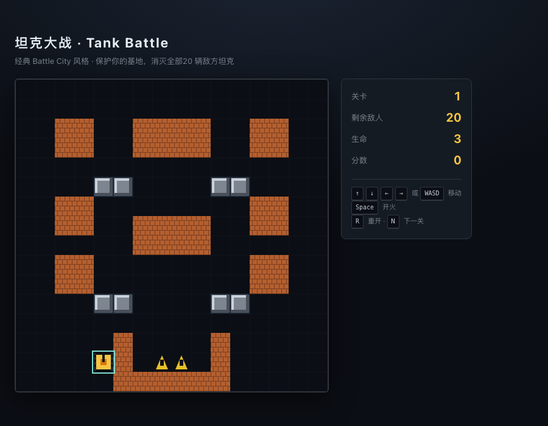

# 坦克大战 · Tank Battle

一个基于 React + HTML5 Canvas 的经典 Battle City 风格坦克大战小游戏。
单文件核心逻辑、纯前端、零后端依赖，`npm run build` 后就是一份可以上传到任意静态托管的 dist 产物。



## 特性

- 16×16 网格 · 32px 瓦片 · 512×512 画布
- 玩家坦克 + 最多 4 辆同屏敌方坦克，每关共 20 辆
- 三种瓦片：**砖墙**（可击碎）、**钢墙**（不可击碎）、**基地**（老鹰，被击中即败北）
- 敌方 AI：概率倾向基地 / 玩家，遇障碍自动换向
- 玩家 2 秒复活无敌盾、双弹丸限制、敌方对射抵消
- 3 张关卡地图循环，通关后 `N` 键进入下一关，血量 +1

## 操作

| 按键 | 作用 |
| --- | --- |
| `↑ ↓ ← →` / `W A S D` | 移动坦克 |
| `Space` | 开火 |
| `R` | 游戏结束后重开 |
| `N` / `Enter` | 通关后进入下一关 |

## 本地运行

```bash
npm install
npm run dev        # 开发模式，默认 http://localhost:5173
npm run build      # 产出 dist/
npm run preview    # 本地预览 dist
```

## 项目结构

```
tank-battle/
├── index.html
├── package.json
├── vite.config.js
└── src
    ├── App.jsx
    ├── main.jsx
    ├── index.css
    └── game
        ├── TankBattle.jsx   # 全部游戏逻辑 + Canvas 渲染
        └── TankBattle.css
```

## 关卡地图 DSL

`src/game/TankBattle.jsx` 中的 `LEVELS` 是一个 `16 × 16` 的字符矩阵：

| 字符 | 含义 |
| --- | --- |
| `.` | 空地 |
| `B` | 砖墙（可击碎） |
| `S` | 钢墙（不可击碎） |
| `#` | 基地 |

添加关卡：复制现有关卡数组，改动 16 行 16 字符即可。玩家默认出生在 `(col=4, row=14)`，敌方从 `(0/7/15, 0)` 三点轮换刷新。

## License

MIT
